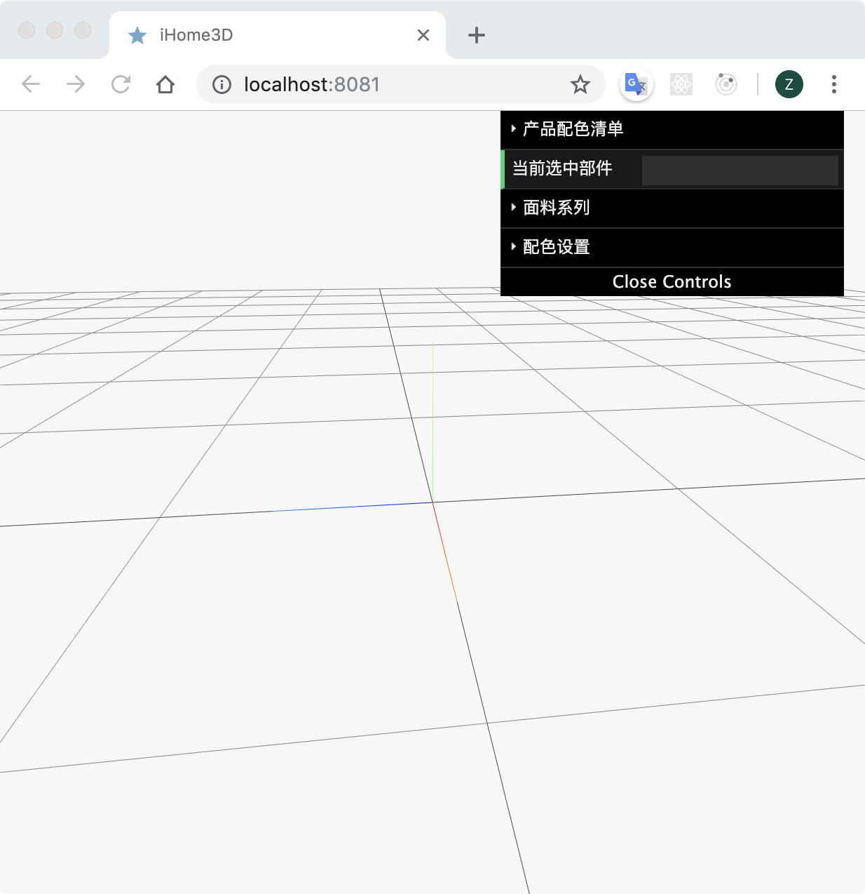

# ypescript/Javascript+WebPack+Three3D+ES6+datGui
实现了一个starter的工程，展示了Typescript/Javascript+WebPack+Three3D+ES6+datGui的结合。展示了Threejs的一个迷你freamwork，并包含了fbx和texture加载的功能。
----
## Screenshots


## Features

- ES6 support with [babel-loader](https://github.com/babel/babel-loader)
- Code formatting with [prettier](https://github.com/prettier/prettier)
- CSS support with [style-loader](https://github.com/webpack-contrib/style-loader)
  and [css-loader](https://github.com/webpack-contrib/css-loader)
- CSS linting with [stylelint](https://stylelint.io/)
- Controls with [orbit-controls-es6](https://www.npmjs.com/package/orbit-controls-es6)
- GUI with [dat.GUI](https://github.com/dataarts/dat.gui)
- GLSL shaders support via [webpack-glsl-loader](https://www.npmjs.com/package/webpack-glsl-loader)
- Tests with [jest](https://jestjs.io/en/), [jest-dom](https://github.com/gnapse/jest-dom)
- Webpack configuration with:
  - [@packtracker/webpack-plugin](https://github.com/packtracker/webpack-plugin) (bundle sizes [here](https://app.packtracker.io/organizations/129/projects/110))
  - [clean-webpack-plugin](https://github.com/johnagan/clean-webpack-plugin)
  - [compression-webpack-plugin](https://github.com/webpack-contrib/compression-webpack-plugin)
  - [duplicate-package-checker-webpack-plugin](https://github.com/darrenscerri/duplicate-package-checker-webpack-plugin)
  - [favicons-webpack-plugin](https://github.com/jantimon/favicons-webpack-plugin)
  - [html-webpack-plugin](https://github.com/jantimon/html-webpack-plugin)
  - [mini-css-extract-plugin](https://github.com/webpack-contrib/mini-css-extract-plugin)
  - [webpack-bundle-analyzer](https://github.com/th0r/webpack-bundle-analyzer)
  - [webpack-glsl-loader](https://github.com/grieve/webpack-glsl-loader)

## Installation

```shell
git clone git@github.com:zzh1234567/typescript-threejs-es6-webpack-starter.git
cd typescript-threejs-es6-webpack-starter
yarn
```

## Usage (development)

Run `webpack-dev-server` (all bundles will be served from memory)

```shell
yarn dev
```

Go to `localhost:8080` to see your project live!

## Usage (production)

Generate all js/css bundles

```shell
yarn build
```

## Other

Analyze webpack bundles offline:

```shell
yarn build  # to generate build/stats.json
yarn stats  # uses webpack-bundle-analyzer as CLI
```

or push to a CI (e.g. [Travis CI](https://travis-ci.com/)), let it build your project and analyze your bundles online at [packtracker.io](https://packtracker.io/).

Check outdated dependencies:

```shell
yarn ncu
```

Update all outdated dependencies at once:

```shell
yarn ncuu
```

## Credits

The setup of this starter project was inspired by
[threejs-es6-webpack-starter](https://github.com/jackdbd/threejs-es6-webpack-starter).

The setup of this starter project was inspired by two snippets on Codepen: [this one](http://codepen.io/mo4_9/pen/VjqRQX) and [this one](https://codepen.io/iamphill/pen/jPYorE).

I understood how to work with lights and camera helpers thanks to
[this snippet](http://jsfiddle.net/f17Lz5ux/5131/) on JSFiddle.

The code for `vertexShader.glsl` and `fragmentShader.glsl` is taken from
[this blog post](http://blog.cjgammon.com/threejs-custom-shader-material).

The star used in the particle system is the PNG preview of [this image](https://commons.wikimedia.org/wiki/File:Star_icon-72a7cf.svg) by Offnfopt
(Public domain or CC0, via Wikimedia Commons).
